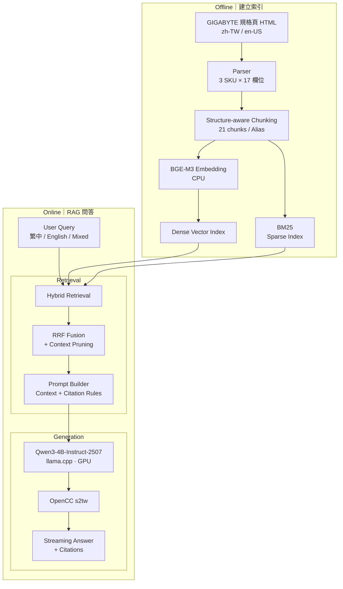

# AORUS MASTER 16 AM6H 規格問答 RAG（4GB VRAM）

以純 Python 手寫的 RAG 系統（未使用 LangChain / LlamaIndex），回答技嘉 GIGABYTE AORUS MASTER 16 AM6H 的產品規格問題，支援繁體中文與英文混合提問、串流輸出。推論使用 llama.cpp，生成模型為 Qwen3-4B-Instruct-2507（Q4_K_M），在 RTX 3050 Laptop 4GB 上實機執行與評測。

## 1. 成果摘要

| 項目 | 結果 |
|---|---|
| 生成模型 | Qwen3-4B-Instruct-2507 Q4_K_M（llama.cpp `llama-server`，generation model 全層 GPU offload，`-ngl 99`） |
| Development benchmark（42 題，開發期間使用） | **42/42**，3 輪皆全對 |
| Held-out benchmark（12 題，未參與開發） | **10/12**（人工判定，3 輪皆同）；失敗集中在需要判斷／推論的問題 |
| 無答案題（development 6 題） | 6/6 正確拒答 |
| Development 引用 | 遵守率 100%、正確率 100%（被引用的 chunk 確實包含答案，36/36） |
| 繁體中文輸出 | OpenCC `s2tw` 轉換後，簡體字外洩 0% |
| E2E TTFT（提問 → 畫面出現第一個字） | p50 **472 ms** / p95 **684 ms** |
| 解碼速度 | 53.4 tok/s（固定 256 tokens） |
| 峰值 VRAM | **3125 MiB / 4096 MiB**（整張 GPU，含 CUDA context） |

數字來自 `eval/results/final_defaults.json` 與 `eval/results/heldout_final.json`；完整實驗見 [docs/EXPERIMENTS.md](docs/EXPERIMENTS.md)。Held-out 以逐題人工複核結果為主；自動評分差異見 EXPERIMENTS.md。

## 2. 題目要求對照

| 要求 | 做法 | 位置 |
|---|---|---|
| 不使用框架，純 Python 實作 Chunking / Retrieval / Generation | 解析、chunking、BM25、向量檢索、RRF、prompt、串流皆手寫；執行期依賴只有 `httpx`、`numpy`、`beautifulsoup4`、`opencc` | `src/aorus_rag/` |
| 使用 uv 管理環境 | `pyproject.toml` + `uv.lock` | 根目錄 |
| 推論引擎 llama.cpp / vLLM | llama.cpp `llama-server`（預編譯 CUDA 版，固定 build b11276），OpenAI 相容 API | `scripts/` |
| 4GB VRAM | 實機 RTX 3050 Laptop 4GB，峰值 3125 MiB；embedding 模型放在 CPU | 第 6 節 |
| 繁體中文與英文混合提問 | 回答語言由程式判定；OpenCC `s2tw` 確保繁體字形；評測含中、英、混合題 | `prompt.py`、`traditional.py` |
| 規格表 Key-Value 解析 | 17 個欄位 × 3 個 SKU = 51 筆，中英欄位名稱對齊 | `parser.py` |
| Vector Index 檢索 | bge-m3（1024 維）正規化向量存於 numpy，與手寫 BM25 以 RRF 融合 | `index.py`、`retriever.py` |
| Streaming 輸出 | 讀取 `llama-server` 的 SSE 串流逐段輸出 | `llm_client.py`、`rag.py` |
| TTFT / TPS | 每題 3 輪取 p50 / p95；TPS 以固定 256 tokens 量測 | `benchmark.py` |
| RAG Pipeline 定性評測 | 42 題 development + 12 題 held-out，規則評分 + 人工檢查 | `eval/`、第 7 節 |

## 3. 快速開始

**環境需求**：Windows 10/11 x64、NVIDIA GPU（≥ 4GB VRAM，驅動需支援 CUDA 13.x，本機為 610.62）、約 4 GB 磁碟空間、網路連線（下載 llama.cpp 與模型）。Python 3.13 由 uv 自動處理。

```powershell
# 允許本視窗執行 repo 內的 .ps1（Windows 預設為 Restricted）
Set-ExecutionPolicy -Scope Process -ExecutionPolicy Bypass

# 安裝 uv（已安裝可略過）
powershell -ExecutionPolicy ByPass -c "irm https://astral.sh/uv/install.ps1 | iex"

git clone https://github.com/112306060/gigabyte-rag-system.git
cd gigabyte-rag-system
uv sync

.\scripts\download_llama_cpp.ps1   # llama.cpp b11276（CUDA 13.4，約 550 MB 下載）
.\scripts\download_models.ps1      # Qwen3-4B-Instruct-2507 Q4_K_M（2.4 GB）+ bge-m3 Q8_0（0.6 GB）
.\scripts\start_servers.ps1        # :8080 生成（GPU）、:8081 embedding（CPU）

uv run aorus-rag                   # 互動問答；加 --show-context 顯示檢索到的 chunk
uv run aorus-rag -q "這台筆電多重？"
```

結束時執行 `Stop-Process -Name llama-server` 關閉兩個 server。

- **VRAM 較吃緊時**：`.\scripts\download_models.ps1 -With3B` 後以 `.\scripts\start_servers.ps1 -GenModel qwen2.5-3b-instruct-q4_k_m.gguf` 啟動（峰值約 2.2 GB；品質差異見第 6 節）。
- **索引已包含在 repo**（`data/processed/`、`index/`）。若要從原始 HTML 重建：`uv run python -m aorus_rag.parser`、`uv run python -m aorus_rag.chunker`、`uv run python -m aorus_rag.index`（最後一步需要 embedding server）。
- **平台**：只在 Windows 上測試。其他平台可自行取得 llama.cpp 後，以與 `scripts/start_servers.ps1` 相同的參數啟動兩個 `llama-server`，其餘 Python 部分不需修改。

## 4. 系統架構



**核心模組**

| 模組 | 職責 |
|---|---|
| `parser.py` | 從規格頁 HTML 取出規格表，輸出 `data/processed/spec_records.json` |
| `chunker.py` | 依規格表結構產生 chunk，輸出 `data/processed/chunks.jsonl` |
| `embedder.py` / `index.py` | 呼叫 embedding server，建立並儲存向量索引 |
| `bm25.py` / `retriever.py` | 稀疏與稠密檢索、RRF 融合、context 後處理 |
| `prompt.py` | system prompt（v1 / v2 / v3，預設 v2）與 user 訊息組裝 |
| `llm_client.py` / `rag.py` | SSE 串流、TTFT / TPS 計時、串接整條 pipeline |
| `traditional.py` | 串流安全的簡轉繁 |
| `cli.py` / `benchmark.py` | 互動問答與評測 |

## 5. 設計說明

**資料解析**：規格頁同時列出 3 個 SKU（BZH / BYH / BXH），17 個欄位中只有顯示晶片不同。繁中頁與英文頁的規格值完全相同（皆為英文），差別只在欄位名稱，因此兩頁依列序對齊，取得中英欄位名稱。頁面中另有一份手機版重複表格，解析時排除；註腳（如 `*May vary by scenario`）與規格值分開存放。

**Chunking**：以「一個規格列 = 一個 chunk」為單位，不採固定長度切分。3 個 SKU 值相同的列合併為一個 chunk，避免重複內容佔滿 top-k；顯示晶片依 SKU 拆分，另加一個型號比較 chunk 與一個規格總覽 chunk，共 21 個。連接埠數量在建索引時以程式計算（USB 共 4 個），因為小模型在回答時清點清單容易出錯。每個 chunk 分成兩份文字：給 LLM 的 `text` 含註腳；用於索引的 `embed_text` 不含註腳，並加入中英別名（如「重量 / 幾公斤 / weight」），以連結使用者用語與英文規格值。

**檢索**：
- Dense：bge-m3（多語言，跑在 CPU）向量正規化後，cosine 即矩陣內積；21 個向量不需要 ANN。
- Sparse：手寫 BM25，英數字整詞保留（`usb3.2`、`5090`），中文以單字 + bigram 切分，不依賴分詞器。
- 融合：Reciprocal Rank Fusion（k=60），只使用排名，避免兩種分數尺度不一致。
- 後處理：同一規格列只保留一個 chunk（問題提到特定 SKU 時選該 SKU，否則選型號比較 chunk），並捨棄 cosine 低於最高分 0.1 以上的 chunk，平均送入 3.75 個 chunk。

**Prompt**：回答語言由程式判定（問題含中文字即以繁體中文回答），不交給模型判斷；產品背景（3 個 SKU 與 GPU 對應）由解析結果產生；context 加上編號並要求引用；資料中沒有答案時使用固定的拒答句。

**繁體中文輸出**：以 OpenCC `s2tw` 轉換生成結果，並將「臺」改回日常使用的「台」。以 1,176 個已存回答實測：`s2twp` 會改壞正確用詞（連接埠→連線埠、擴展→擴充套件），`s2t` 會使用非台灣字形（峰→峯），因此採用只轉字形的 `s2tw`。串流時在標點、空白或英數字處切段後再轉換，避免切斷需要上下文的詞（如 头发→頭髮），E2E TTFT 平均約增加 30 ms。

## 6. 模型選擇與 4GB VRAM

三個模型在相同條件下比較：prompt v2、hybrid 檢索、42 題、品質以第 1 輪評分。此組矩陣實驗在加入 OpenCC 之前執行，因此與第 1 節的最終數字（含 OpenCC）不完全相同。

| 模型（Q4_K_M） | 峰值 VRAM | 準確率 | 無答案正確拒答 | 引用遵守率 | E2E TTFT p50 / p95 | TPS | 6 組設定下的準確率範圍 | 6 組設定下的拒答率範圍 |
|---|---|---|---|---|---|---|---|---|
| Qwen2.5-1.5B-Instruct | 1205 MiB | 85.7% | 33.3% | 0% | 214 / 312 ms | 107.2 | 85.7–88.1% | 33.3% |
| Qwen2.5-3B-Instruct | 2159 MiB | 92.9% | 66.7% | 2.8% | 351 / 535 ms | 70.7 | 90.5–92.9% | 66.7–100% |
| **Qwen3-4B-Instruct-2507** | 3125 MiB | **100%** | **100%** | **100%** | 447 / 677 ms | 53.0 | 97.6–100% | 100% |

「6 組設定」為 prompt v1 / v2 / v3、無後處理、只用 dense、只用 BM25，完整矩陣見 [EXPERIMENTS.md 第 2 節](docs/EXPERIMENTS.md)。

**選擇 Qwen3-4B-Instruct-2507 的理由**：
- 6 組設定下皆未在無答案題中編造答案，引用遵守率約 92–100%。
- Qwen2.5-1.5B 在無答案題上的正確拒答率只有 33.3%，並出現由 99Wh 推算續航時數、將 275HX 誤當成 275W 等明顯編造。
- Qwen2.5-3B 對 prompt 較敏感：v2 降低誤拒，但無答案題拒答率降至 66.7%；v3 將拒答率提高至 83.3%，但又增加有答案題的誤拒。三個 prompt 版本整體準確率皆為 92.9%。
- 選用 `Instruct-2507`（非思考版本），回答前不會輸出 `<think>` 推理段落，TTFT 不會因此拉長。

**VRAM 預算**：
- 本機為 Optimus 架構，桌面由內顯輸出，未載入模型時獨顯 VRAM 用量 2 MiB。
- 生成 server 峰值 3125 MiB（2.4 GB 權重 + ctx 4096 的 KV cache + CUDA buffer），剩餘約 970 MiB。
- Embedding server 以 `--device none` 只用 CPU。僅設 `-ngl 0` 時，CUDA 版 llama.cpp 仍會建立 CUDA context，佔用約 450 MiB VRAM。
- `-np 1` 只配置一份 KV cache（單一使用者）。
- 若筆電由獨顯直接輸出桌面，可用 VRAM 會較少，可改用 Qwen2.5-3B（峰值 2159 MiB）。

## 7. 評測結果

**方法**
- Development set（`eval/golden_qa.jsonl`）：42 題，含基本、口語、中英混合、SKU、需彙整及 6 題無答案題。開發期間曾依其結果調整 prompt 與評分規則。
- Held-out set（`eval/heldout_qa.jsonl`）：12 題，涵蓋跨欄位、SKU 反查、I/O 位置、易幻覺推論等情況。題目與評分規則在執行前 commit，執行後不修改系統。
- 評分：以規則判定必要事實、拒答句與禁止內容（可辨識否定語境），並逐題人工檢查；不使用 LLM 評審。
- 每題跑 3 輪，輪次在外層，連續請求必為不同問題；生成 server 關閉 `--cache-ram`，只重用共用的 system prompt 前綴。
- E2E TTFT 從送出問題計算到畫面出現第一個字（含檢索與繁體轉換緩衝）；TPS 以 `ignore_eos` 固定生成 256 tokens，client 與 server 量測一致。

**最終設定結果**

| 指標 | Development（42 題） | Held-out（12 題） |
|---|---|---|
| 準確率（第 1 / 2 / 3 輪） | 100% / 100% / 100% | 83.3% / 83.3% / 83.3%（人工判定） |
| 3 輪皆答對 | 42 / 42 | 10 / 12 |
| 引用遵守率 / 正確率 | 100% / 100% | 91.7% / 100%（人工判定） |
| 簡體字外洩 | 0% | 0% |
| E2E TTFT p50 / p95 | 472 / 684 ms | 382 / 701 ms |
| 峰值 VRAM | 3125 MiB | 3125 MiB |

Held-out 自動評分與人工判定有 2 處不同（h10 第 2 輪自動判對、人工判錯；h02 一個引用自動判錯、人工判對），兩者並列於 [EXPERIMENTS.md 第 7 節](docs/EXPERIMENTS.md)。

**Held-out 的發現**：事實查詢、SKU 對照、I/O 位置、中英混合與口語題 3 輪皆答對。失敗的 2 題都屬於需要判斷的問題：
- h10「跑得動《黑神話：悟空》嗎？」：模型以外部知識斷言可以運行，其中一輪提到規格資料中沒有的 DLSS 3.0。
- h11「TDP 沒寫可以從時脈推算嗎？」：只回答「規格資料中未提及」，沒有編造，但未回答問題本身。

因此 development set 的「無答案題 6/6 正確拒答」只適用於詢問不存在的事實；需要推論或評價的問題仍可能引入外部知識。

**檢索**：development set 上 hybrid 的 Hit@1 / MRR 為 0.917 / 0.942，高於 dense（0.889 / 0.926）與 BM25（0.889 / 0.933）；送入 LLM 的 context 100% 包含正確 chunk。Held-out 上 hybrid（0.750 / 0.875）略低於 dense（0.833 / 0.889），樣本為 12 題，差 1 題即差 8.3 個百分點。

## 8. 開發過程的關鍵發現

- **評測方法本身的錯誤**：第一版評測中同一題連續重跑，加上 `llama-server` 預設以 RAM 保存先前的 prompt（`--cache-ram`），使 TTFT p50 只有 40 ms；修正後為約 300 ms。之後所有數字皆以修正後的方法重跑。
- **以數據否決功能**：原本在檢索相似度偏低時提示模型「可能沒有答案」，但有答案題與無答案題的 top-1 cosine 分布重疊（0.44–0.53），無法設定門檻，因此移除。
- **Prompt 調整的上限**：Qwen2.5-3B 的三個 prompt 版本各自修好一部分題目、又弄壞另一部分；換成 Qwen3-4B 後，未再針對 4B 調整的 prompt v2 即可在 development benchmark 達到 42/42，顯示瓶頸在模型而非 prompt。
- **參數名稱與實際行為不同**：`-ngl 0` 不代表不使用 GPU，需要 `--device none` 才能讓 embedding server 完全不佔 VRAM。
- **轉換工具也需要驗證**：直覺上最完整的 `s2twp` 會把正確的「連接埠」改成「連線埠」，因此先以既有回答測試再選擇設定。

## 9. 已知限制與未來工作

- Development set 在開發期間反覆使用，42/42 偏樂觀；held-out 只有 12 題。
- 需要判斷或評價的問題（如遊戲效能）可能引入外部知識。可加入「不評論效能」的規則或問題分類，並以新的 held-out 題目驗證。
- `s2tw` 只轉換字形，回答中仍可能出現大陸用詞（如 線程、性能、刷新率）。可加入小型 IT 術語對照表。
- temperature 0.1 且未固定 seed，回答措辭在不同輪次間會變動（兩次 3 輪評測的對錯皆一致）。
- 只在 Windows + RTX 3050 Laptop（Optimus）上測試；腳本為 PowerShell。
- 規格資料取自 2026-09-30 儲存的官網 HTML 快照，官網更新後需重新解析。

## 10. 專案結構

```
├── data/raw/                  規格頁 HTML 快照（zh-TW、en-US）
├── data/processed/            spec_records.json、chunks.jsonl
├── index/                     vectors.npy、meta.json
├── src/aorus_rag/             RAG 實作（見第 4 節）
├── scripts/
│   ├── download_llama_cpp.ps1 下載固定版本的 llama.cpp
│   ├── download_models.ps1    下載模型（-With3B / -Compare 為選用）
│   ├── start_servers.ps1      啟動生成與 embedding server
│   └── run_matrix.ps1         模型 × 設定實驗矩陣
├── eval/
│   ├── golden_qa.jsonl        development set（42 題）
│   ├── heldout_qa.jsonl       held-out set（12 題）
│   ├── heldout_manual_review.json
│   ├── results/               每次評測的 JSON 與 Markdown
│   ├── make_report.py         產生 docs/EXPERIMENTS.md
│   ├── regrade.py             以目前規則重新評分已存結果
│   └── test_heldout_grader.py 評分規則測試
└── docs/EXPERIMENTS.md        完整實驗紀錄
```

## 11. 重現實驗

需先完成第 3 節並啟動兩個 server。

```powershell
uv run aorus-bench --name my_run                                      # development set，最終設定，3 輪
uv run aorus-bench --name my_heldout --questions eval/heldout_qa.jsonl
.\scripts\download_models.ps1 -Compare; .\scripts\run_matrix.ps1      # 3 模型 × 6 設定（約 30 分鐘）
uv run python eval\make_report.py                                     # 重新產生 docs/EXPERIMENTS.md
uv run python eval\test_heldout_grader.py                             # 評分規則測試
```

`aorus-bench` 其他參數：`--prompt v1|v2|v3`、`--mode hybrid|dense|bm25`、`--no-prune`、`--no-traditional`、`--repeat N`。
